# External GPT V4 revision — graph-engineered execution plan

**REVISION 2 — validated candidate.** Revision 1's sections 3, 9, 10.4 and 12
are historical: their P1/P2 ready-lane caption is superseded by section 13.
Schema `1.2` removes hand-authored ready/batch fields; the validator computes
the schedule from epoch state plus hard predecessors.

**Decision:** adopt a two-layer V4 architecture. `BLUEPRINT-V4-DRAFT.md` remains the requirements and gate authority. `V4-PHASE1-EXECUTION-GRAPH-2026-08-02.json` becomes the candidate execution-order authority after Fable ratifies it. The existing fake-edge map becomes provenance for the graph, not a second scheduler.

**Status:** external-advisor candidate, published for Fable to consume. It does not silently edit the campaign blueprint or authorize production/live-capital action.

## 1. Why V4 needed this revision

V4 currently contains three different scheduling surfaces:

1. a numbered critical path in `§15.6`;
2. a historical parallel-lanes register in `§9`;
3. a separate graph-lanes fake-edge map.

Each is useful, but none is the single executable truth. A worker must read prose, infer dependencies, ask whether an edge is real, and then wait for another ruling. That is where the campaign loses time.

The revision separates two questions that should never have shared one document:

- **What must be true?** The blueprint and rulings answer this.
- **What may run now, in parallel with what, and what exact artifact unlocks the next node?** The graph answers this.

## 2. The revised graph

```mermaid
flowchart LR
  P0D[P0-vNext design] --> P0P[AR-589 prototype] --> P0PC[prototype correction + red-proof] --> P0PG[independent prototype grade] --> P0VC[graded design closure] --> P0DG[design grade] --> P0I[implementation] --> P0IG[implementation grade]

  P1[current baseline]
  P2[truth membership]
  P3[lane-authority ruling]
  REG[register pin]

  P0IG --> GBP[Gate-B producer proof]
  P1 --> GBP
  P2 --> GBP
  P3 --> GBP
  REG --> GBP

  GBP --> GBR[runtime integration]
  P3 --> GBR
  GBR --> GBS[source-keyed sweep]
  P1 --> GBS
  P2 --> GBS

  GBS --> RERANK[current Tier-A rerank]
  RERANK --> RESPIN[targeted corpus-B respin]
  RESPIN --> BFREEZE[current Surface-B freeze]
  BFREEZE --> BIND[load-bearing binding]
  BIND --> FIDELITY[compile-fidelity calibration]
  P0IG --> FIDELITY
  BIND --> EXIT[Phase-1 exit]
  FIDELITY --> EXIT

  EXIT --> PH2[Phase-2 battery]
  PH2 --> PH3[Phase-3 paper + shadow]
  PH3 --> PH35[Phase-3.5 funded]
  PH35 --> PH4[Phase-4 scale]
```

This exposes the real Phase-1 fan-in: `P0IG + P1 + P2 + P3 + REG → Gate B`. It also preserves the genuinely serial compiler-design chain: each `P0D` correction consumes the previous revision and writes the same artifact.

## 3. The speed change that should happen now

The old sequencing placed P1 and P2 behind P0 even though neither consumes a P0 output. The fake-edge map already measured that dependency as policy, not data. The revised schedule removes it.

### Worker lanes now

| lane | task | why it can run independently |
|---|---|---|
| 1 | `P0PC` — correct and red-proof the AR-589 admission prototype | consumes AR-589 plus R-543, R-544, and external-review defects; no P1/P2 artifact consumed |
| 2 | `P1` — freeze the current additive baseline | reads current producer/corpus; writes its own pinned baseline artifact |
| 3 | `P2` — freeze source-keyed truth membership | reads frozen source material; writes a different truth artifact |

### Advisor clock now

`P3` — rule the producer-proof/runtime-integration lane authority. Judgment is not counted as a worker lane and cannot be delegated as one.

### Parked when capacity competes

`I7`, `I8`, and `I21` remain legitimate side work. They do not pre-empt P1/P2 merely because they were once listed in “Batch 1.” `I21` runs only when the register pin needed by `REG` is stale. Off-path work may use spare width; it may not occupy the critical path’s width.

This is the main acceleration: by the time P0 is corrected, designed, implemented, and graded, the baseline, truth set, and lane ruling can already be waiting at the Gate-B fan-in instead of starting afterward.

AR-587 also exposed a different graph class: an edge can carry hidden **toolchain state**. A TypeScript mutation does not become valid merely because its source file exists; its result depends on the TypeScript version, compiler options, standard libraries and ambient declarations. R-541 then correctly pivoted to an executable prototype. AR-589 proved the pivot useful but not yet authoritative: the prototype discovered one rule bug, while R-543 found semantic-validity, ambient-type, and ownership gaps, and R-544 consumed the external review after independently reproducing the module-identity, required-membership, and process-enforcement defects. The graph therefore separates `P0P` (delivered evidence), `P0PC` (active correction), and `P0PG` (independent grade). Only the graded result crosses into `P0VC`. This is a real evidence edge, not another prose-review loop.

## 4. A graph edge is an artifact contract

An edge is real only when the downstream node consumes a named output from the upstream node. Each hard edge in the JSON manifest therefore carries:

- `from` and `to` node IDs;
- edge type (`data`, `authority`, `oracle`, `control`, `gate`, or shared-resource pin);
- `hard: true`;
- the exact artifact that crosses the boundary.

If no artifact crosses, the edge is fake and is removed. “Do this first because the list says so” is not an edge.

Shared resources are different: they are hidden serialization constraints, not business dependencies. The register is modelled as a pin (`REG`), so readers may proceed against a hash while a later refresh becomes a new version rather than a race.

## 5. Node contract

Every node carries the same minimum shape:

| field | purpose |
|---|---|
| `id` | stable join key; names never double as captions |
| `kind` / `phase` | separates implementation, evidence, judgment, grade, and milestone |
| `state_at_epoch` | dated snapshot, never timeless truth |
| `owner` | a seat or gate that exists, never “next session” |
| `wip_class` | enforces one money-path implementation and one independent grade |
| `outputs` | artifacts that downstream edges may consume |
| `acceptance` | the property that closes the node |

Dynamic status never lives only in prose. Every refresh records the campaign commit and newest AR used as its epoch. A stale snapshot must fail closed rather than appearing current because node names still match.

## 6. Scheduler rules

1. Validate node IDs, edge endpoints, hard-edge artifacts, and acyclicity.
2. Re-read the status sources and pin the epoch.
3. A node is ready only when every incoming hard-edge artifact exists and passes its acceptance predicate.
4. Choose at most four worker lanes. Only one may be a money-path implementation. Only one independent grade may be active.
5. Rank ready nodes by money-path membership, then downstream fan-out unlocked. Side lanes use spare capacity only.
6. At fan-in, compare the **set of received predecessor IDs** with the expected set. A missing lane is RED, not an omission.
7. Rulings, anchors, frozen truth sets, and live-capital decisions never parallelize as worker lanes.
8. Any evidence change invalidates descendants whose input artifact changed; it does not restart unrelated branches.
9. A mutation result is admitted only against its content-pinned compiler surface. Host-installed declarations are never implicit evidence.
10. A mutation has one primary diagnostic owner. Specific syntax catchers take precedence over generic ambient/reference catchers, and competing catchers must remain silent in the red-proof.

The expected fan-in sets are stored independently in `fan_in_contracts`; they are not inferred from the edge list being checked. Otherwise deleting an edge would shrink both the evidence and the supposed expectation, producing a self-consistent false green.

## 7. Phase boundaries remain intact

This graph does not redefine success:

- **Phase 1 exit (verbatim authority):** “≥1 tier-A spec compiles with ALL load-bearing conditions concretely bound AND the compile-fidelity forensics gate passes calibration.” Surface B must still be frozen from the current population before the gate runs.
- **Phase 2 exit:** the first battery wave yields either a pre-registered survivor or an attribution-complete no-survivor routing verdict.
- **Phase 3 exit:** at least one survivor completes paper and shadow parity, with its eval-odds briefing and in-season decision recorded.
- **Phase 3.5/4:** real funded operation and scaling remain operator-reserved.

Therefore “compiler complete” is not “trading ready.” The graph makes that boundary explicit instead of allowing a green P0 instrument to be read as strategy progress.

The `PH2 → PH3` edge is admitted only for a survivor packet. An attribution-complete no-survivor verdict ends that graph run and seeds a newly versioned remediation graph; it is not drawn as a back-edge that would hide iteration inside a cycle.

## 8. What this revision deliberately does not do

- It does not rewrite the campaign blueprint in a shared file.
- It does not claim Revision 4 is adopted merely because recent work has followed it.
- It does not invent durations or a percentage-complete metric from node counts.
- It does not authorize Gate B, production changes, a merge, deployment, or capital.
- It does not make side-lane completion a Phase-1 gate.
- It does not expand Phases 2–4 into fake detail before Phase 1 produces a real survivor population.

## 9. Machine checks required at adoption

The JSON graph must fail if:

- a node ID is duplicated;
- an edge references a missing node;
- a hard edge has no named artifact;
- the graph contains a cycle;
- a fan-in omits an expected predecessor;
- a state snapshot lacks an epoch;
- more than one money-path implementation or independent grade is marked active;
- a node is marked ready while an incoming hard artifact is absent;
- a mutation-bearing design edge omits its compiler-surface identity or primary-catcher ownership artifact;
- the blueprint and graph disagree on a phase-exit sentence.

The clean control is the current graph parsing successfully. Red controls must include a planted cycle, a missing endpoint, a blank hard-edge artifact, a missing fan-in predecessor, two simultaneously active money-path implementations, a changed ambient declaration hash, and one mutation claimed by two primary catchers.

### Candidate self-check at publication

The external advisor ran an in-memory structural validator against this exact candidate: `28` nodes, `31` edges, all `28` node IDs unique, and a clean result with zero errors. Eight independently planted graph defects each went red through the intended invariant: duplicate node ID, missing endpoint, blank hard-edge artifact, cycle, deleted `P2 → GBP` fan-in edge, two active money-path implementations, missing ruling-epoch pin, and a weakened `P0PC` correction contract. The three source Git-blob OIDs also re-hashed equal to the values recorded in the manifest, and the Phase-1 exit string was re-read verbatim from the blueprint.

The current epoch is joined explicitly: newest report `AR-589` at `8297ebbe`, newest ruling `R-544` at `eaca5324`, and `ADVISOR-STATE` blob `f7166fcb`. A later AR, ruling, or state rewrite invalidates the node states until the graph is refreshed; matching node names are not freshness.

This is a publication receipt, not standing enforcement. The adopted graph still needs the committed validator in step 5 below; the compiler-surface drift and dual-catcher red controls become executable only after `P0VC` emits those artifacts.

## 10. Adoption sequence for Fable

1. Review this graph against the newest `ADVISOR-STATE.md`, AR, and current blueprint; update only state snapshots that have changed.
2. Ratify the two-layer authority rule: blueprint = requirements, graph = execution ordering.
3. Copy the graph manifest into the campaign branch and record its hash in the adopting ruling.
4. Authorize the three worker lanes (`P0PC`, `P1`, `P2`) plus advisor-owned `P3`, each with its full file/scope/test contract.
5. Add a small graph validator with the red controls above before using graph output as an automatic scheduler.
6. On every ruling, update node state and artifact identity in the same commit; no state update without its evidence pointer.
7. Carry the adopted graph into `advisor-onboarding`, `worker-onboarding`, `worker-execution`, and `advisor-ruling`: cold seats read the graph epoch and their current node; workers prove hard predecessors before execution; rulings mutate node state and artifact identity in the same motion.

## 11. Runtime onboarding integration

The graph contract is now carried by the active cross-runtime skill mirrors under
`C:/Users/tonio/Projects/trading-forge/.agents/skills/` and `.claude/skills/`:

| skill | enforced graph behavior | byte-identical mirror sha256 |
|---|---|---|
| `advisor-onboarding` | candidate-versus-adopted distinction; epoch join; current node, hard predecessors, and ready set | `3ccc2df77d71b1364f2ca37fa1366c78705f6788aca5057c917aaaf8e829e4ff` |
| `worker-onboarding` | graph-node start receipt with expected/received predecessors, output, and shared resources | `0e16056f0e310276e3b40a41a02c7b288f866fca846a51ebf21d9727cc78a4a6` |
| `worker-execution` | artifact admission before node execution; independent fan-in set; advisor-owned completion transition | `7c1713380e1ab34f8d3260128f975df5f2f2b778babbc2ca1f540f8ba69141ee` |
| `advisor-ruling` | mandatory graph object/transition/fan-in fields; graph state and evidence hash updated in the ruling commit | `ea417478da74d2e81787693eccae9fef78aad6c732486cd23813b2240bc56816` |

For each skill, the pre-edit structural probe found the blueprint/parallel-lane
carrier but no V4 graph path or node contract. After the edit, the required
fields were present, `quick_validate.py` passed under explicit UTF-8, and the
`.agents` / `.claude` hashes matched. The first worker-onboarding validation run
failed because Python inherited Windows `cp1252` while reading a valid UTF-8
skill; rerunning with `PYTHONUTF8=1` passed. That failure was in the validator's
environment, not repaired by altering the skill.

These skill directories are runtime-level controls outside this external Git
worktree. The table is their durable receipt; Fable's adopting ruling should
name the canonical skill source if it wants their bytes versioned in-repo.

## 12. Breakthrough consequence

The breakthrough is not “more agents.” It is removing waits that do not carry data while keeping the edges that protect truth.

Under the old list, P1 and P2 started after P0. Under this graph, they finish beside it. The serial chain after the Gate-B fan-in remains honest, but three prerequisites stop consuming serial campaign cycles. That is the fastest safe route to Phase-1 compiler exit without confusing instrument qualification with a trading-ready strategy.

## 13. Revision-2 correction and validator receipt

R-547 measured the revision-1 scheduling caption stale: P1 and P2 were already
completed evidence. They remain hard-edge inputs to `GBP` and `GBS`, with their
exact artifacts and recensus limitations pinned, but they are never scheduled
again. The JSON now stores no ready set and no recommended batch. The validator
computes the current worker batch `[P0PC]`, advisor clock `[P3]`, and completed
evidence `[P1,P2]`.

The epoch is joined at campaign commit `81c46400`: newest report `AR-593`,
newest ruling `R-550`, and `ADVISOR-STATE` blob `dce2a9a7`. Any later report,
ruling, state rewrite, or campaign commit makes the candidate fail closed until
refreshed.

`node scripts/test-validate-v4-phase1-graph.mjs` admits the clean graph and
drives 24 distinct planted failures red, including the founding P1/P2 re-entry,
joint edge-plus-fan-in deletion, hand-authored derived readiness, stale epoch,
changed authority/artifact pins, unknown-state residual, weakened Phase-1 exit,
lane limits, and a completed mutation edge without compiler/ownership evidence.

The clean receipt reports `28` nodes, `31` edges, `12` artifact pins, `14`
completed-edge evidence references, verified Phase-1 exit and epoch, worker
batch `[P0PC]`, and advisor clock `[P3]`. This is builder evidence, not an
independent grade. Adoption still requires Fable's named ruling; scheduling from
the external candidate remains forbidden before that switch.
